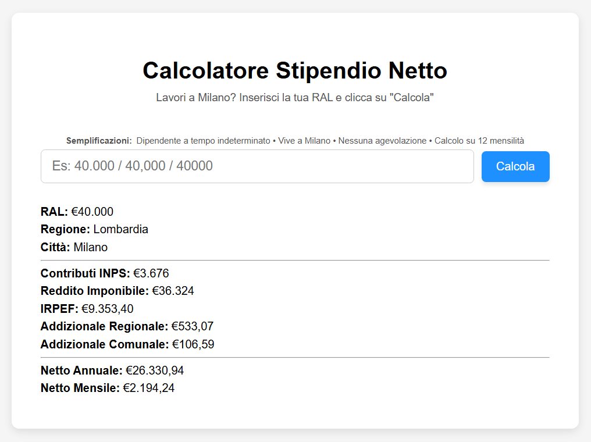

# Calcolatore Stipendio Netto
Breve web app demo per calcolare lo stipendio netto annuale e mensile a partire dalla RAL, con dettaglio di contributi INPS, IRPEF, addizionali regionali e comunali.  
Realizzato in **Python 3 + Flask**, pronto per il deploy anche su Docker.

Provalo a questo [link](https://net-salary-calculator.onrender.com)!

---

## Semplificazioni
1. Il dipendente è un impiegato a tempo indeterminato
2. Il dipendente vive a Milano
3. Il dipendente non ha nessun tipo di agevolazione particolare
4. Lo stipendio è calcolato su 12 mensilità
 
## Fonti dati utilizzati
Utilizzate aliquote al 2025. Non prevista quindi la riduzione aliquota del secondo scaglione IRPEF inserita con legge di bilancio 2026.
1. [Aliquote IRPEF](https://www.agenziaentrate.gov.it/portale/imposta-sul-reddito-delle-persone-fisiche-irpef-/aliquote-e-calcolo-dell-irpef)         
2. [Addizionale regionale](https://www1.finanze.gov.it/finanze2/dipartimentopolitichefiscali/fiscalitalocale/addregirpef/addregirpef.php?reg=10&anno=2025) 
3. [Addizionale comunale](https://www1.finanze.gov.it/finanze2/dipartimentopolitichefiscali/fiscalitalocale/nuova_addcomirpef/risultato.htm?cc=F205&amp;lista=0) 

---

## Possibili scalabilità predisposte (con piccole modifiche)
1. Regioni aggiuntive
2. Comuni aggiuntivi
3. Calcolo su 13 o 14 mensilità
4. Tipologie di contratto aggiuntive

---

## Funzionalità 
Inserisci la RAL e clicca su "calcola" per ottenere:
  - Contributi INPS a carico del lavoratore
  - Reddito imponibile
  - IRPEF
  - Addizionale regionale (solo Lombardia)
  - Addizionale comunale (solo Milano)
  - Stipendio netto annuale e mensile

---

## Tecnologie
- Python 3.11
- Flask 3.1.3
- Docker 
- HTML/CSS

---

